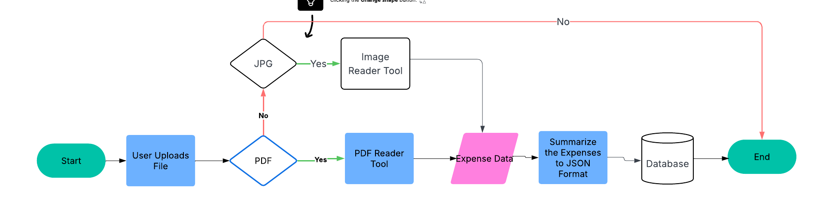

# AI Expense Receipt Reader
1. Expense Receipt Reader is a Agentic AI application which receives the Expense Receipt(PDF,JPG format) from the user and summarizes the Expenses into different Categories and inserts them into the database.
2. The Categories that are currently defined are Food, Hotel, Travel, Taxes, Fees, Liquor(Alchoholic drinks),Other(Gym or Spa Expenses)
3. Total Amount for each category is calculated.
4. Final Amounts are then inserted into the sqlite database.
5. Techstack used is Langchain,CrewAI,Python(PyPDF,Pillow,Tesseract libraries)
6. Below is the Flowchart of the whole process
   